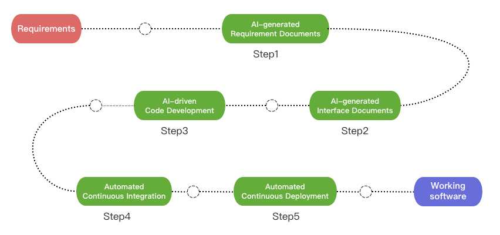
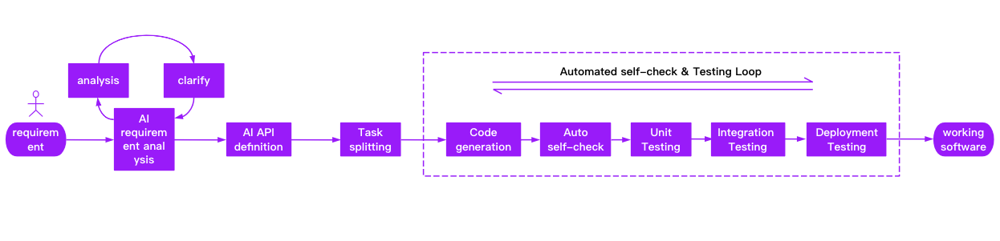

# DevOpsGPT: AI-Driven Software Development Automation Solution

<p align="center">
<a href="docs/README_CN.md"></a>
<a href="README.md"></a>
<a href="docs/README_JA.md"></a>
<a href="http://www.kuafuai.net"></a>
<a href="docs/CONTACT.md"></a>
<a href="https://discord.gg/4RMUCZwnxF"></a>
</p>

### 💡 Get Help - [Q&A](https://github.com/kuafuai/DevOpsGPT/issues) 
### 💡 Submit Requests - [Issue](https://github.com/kuafuai/DevOpsGPT/discussions)
### 💡 Technical exchange - service@kuafuai.net

<hr/>

## Introduction
Welcome to the AI Driven Software Development Automation Solution, abbreviated as DevOpsGPT. We combine LLM (Large Language Model) with DevOps tools to convert natural language requirements into working software. This innovative feature greatly improves development efficiency, shortens development cycles, and reduces communication costs, resulting in higher-quality software delivery.

</a>

## Features and Benefits

- Improved development efficiency: No need for tedious requirement document writing and explanations. Users can interact directly with DevOpsGPT to quickly convert requirements into functional software.
- Shortened development cycles: The automated software development process significantly reduces delivery time, accelerating software deployment and iterations.
- Reduced communication costs: By accurately understanding user requirements, DevOpsGPT minimizes the risk of communication errors and misunderstandings, enhancing collaboration efficiency between development and business teams.
- High-quality deliverables: DevOpsGPT generates code and performs validation, ensuring the quality and reliability of the delivered software.
- [Enterprise Edition] Existing project analysis: Through AI, automatic analysis of existing project information, accurate decomposition and development of required tasks on the basis of existing projects.
- [Enterprise Edition] Professional model selection: Support language model services stronger than GPT in the professional field to better complete requirements development tasks, and support private deployment.
- [Enterprise Edition] Support more DevOps platforms: can connect with more DevOps platforms to achieve the development and deployment of the whole process.

## Demo（Click to play video）

1. <a href="https://www.youtube.com/watch?v=KGeWgM6HzR4" target="_blank">DevOpsGPT Vision video</a>
2. <a href="https://www.youtube.com/watch?v=3peUJeB_afo" target="_blank">Demo - Software development and deployment to Cloud</a>
3. <a href="https://www.youtube.com/watch?v=IWUPbGrJQOU" target="_blank">Demo - Develop an API for adding users in Java SpringBoot</a>


## Workflow
Through the above introduction and Demo demonstration, you must be curious about how DevOpsGPT achieves the entire process of automated requirement development in an existing project. Below is a brief overview of the entire process:



- Clarify requirement documents: Interact with DevOpsGPT to clarify and confirm details in requirement documents.
- Generate interface documentation: DevOpsGPT can generate interface documentation based on the requirements, facilitating interface design and implementation for developers.
- Write pseudocode based on existing projects: Analyze existing projects to generate corresponding pseudocode, providing developers with references and starting points.
- Refine and optimize code functionality: Developers improve and optimize functionality based on the generated code.
- Continuous integration: Utilize DevOps tools for continuous integration to automate code integration and testing.
- Software version release: Deploy software versions to the target environment using DevOpsGPT and DevOps tools.

## Use Cloud Services
Vists [kuafuai.net](https://www.kuafuai.net)

## Quick Start

1. Run with source code
    1. Download the [released version](https://github.com/kuafuai/DevOpsGPT/releases), or clone the latest code(instability), Ensure SQLite and Python3.7 or later is ready.
    2. Generate the configuration file: Copy `env.yaml.tpl` and rename it to `env.yaml`.
    3. Modify the configuration file: Edit `env.yaml` and add the necessary information such as GPT Token (refer to [documentation link](docs/DOCUMENT.md) for detailed instructions).
    4. Run the service: Execute `sh run.sh` on Linux or Mac, or double-click `run.bat` on Windows.
    5. Access the service: Access the service through a browser (check the startup log for the access address, default is http://127.0.0.1:8080).
    6. Complete requirement development: Follow the instructions on the page to complete requirement development, and view the generated code in the `./workspace` directory.

2. Run with Docker
    1. Create a directory: `mkdir -p workspace`
    2. Copy [env.yaml.tpl](https://github.com/kuafuai/DevOpsGPT/blob/master/env.yaml.tpl) from the repository to the current directory and rename it to `env.yaml`
    3. Modify the configuration file: edit `env.yaml` and add necessary information such as GPT Token.
    4. ```
        docker run -it \
        -v$PWD/workspace:/app/workspace \
        -v$PWD/env.yaml:/app/env.yaml \
        -p8080:8080 -p8081:8081 kuafuai/devopsgpt:latest
        ```
    5. Access the service: Access the service through a browser (access address provided in the startup log, the default is http://127.0.0.1:8080).
    6. Complete the requirement development: complete the requirement development according to the guidance of the page, and view the generated code in the `./workspace ` directory

**For detailed documentation and configuration parameters, please refer to the [documentation link](docs/DOCUMENT.md).**


## Limitations
Although we strive to enhance enterprise-level software development efficiency and reduce barriers with the help of large-scale language models, there are still some limitations in the current version:

- The generation of requirement and interface documentation may not be precise enough and might not meet developer intent in complex scenarios.
- In the current version, automating the understanding of existing project code is not possible. We are exploring a new solution that has shown promising results during validation and will be introduced in a future version.

## Product Roadmap

- Accurate requirement decomposition and development task breakdown based on existing projects.
- New product experiences for rapid import of development requirements and parallel automation of software development and deployment.
- Introduce more software engineering tools and professional tools to quickly complete various software development tasks under AI planning and execution.

We invite you to participate in the DevOpsGPT project and [contribute](./docs/CONTRIBUTING.md) to the automation and innovation of software development, creating smarter and more efficient software systems!

## Disclaimer

This project, DevOpsGPT, is an experimental application and is provided "as-is" without any warranty, express or implied. By using this software, you agree to assume all risks associated with its use, including but not limited to data loss, system failure, or any other issues that may arise.

The developers and contributors of this project do not accept any responsibility or liability for any losses, damages, or other consequences that may occur as a result of using this software. You are solely responsible for any decisions and actions taken based on the information provided by DevOpsGPT.

Please note that the use of the GPT language model can be expensive due to its token usage. By utilizing this project, you acknowledge that you are responsible for monitoring and managing your own token usage and the associated costs. It is highly recommended to check your OpenAI API usage regularly and set up any necessary limits or alerts to prevent unexpected charges.

As an autonomous experiment, DevOpsGPT may generate content or take actions that are not in line with real-world business practices or legal requirements. It is your responsibility to ensure that any actions or decisions made based on the output of this software comply with all applicable laws, regulations, and ethical standards. The developers and contributors of this project shall not be held responsible for any consequences arising from the use of this software.

By using DevOpsGPT, you agree to indemnify, defend, and hold harmless the developers, contributors, and any affiliated parties from and against any and all claims, damages, losses, liabilities, costs, and expenses (including reasonable attorneys' fees) arising from your use of this software or your violation of these terms.

## Reference project
- https://github.com/Significant-Gravitas/Auto-GPT
- https://github.com/AntonOsika/gpt-engineer
- https://github.com/hwchase17/langchain
