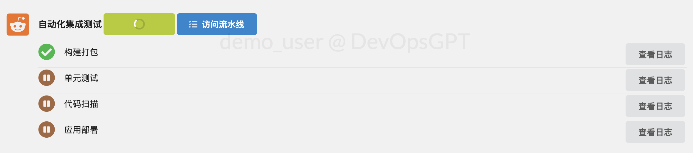

# 快速开始

1. 克隆最新代码或选择已发布的版本，准备好 Python3.7 或以上版本。
2. 生成配置文件：复制 `env.yaml.tpl` 并重命名为 `env.yaml`。
3. 修改配置文件：编辑 `env.yaml`，添加GPT Token等必要信息。
4. 运行服务：在 Linux 或 Mac 上执行 `sh run.sh`，在 Windows 上双击运行 `run.bat`。
5. 访问服务：通过浏览器访问服务（启动日志中提供的访问地址，默认为 http://127.0.0.1:8080）。
6. 完成需求开发：按照页面引导完成需求开发，在 `./workspace` 目录下查看生成的代码。

# 配置说明

### 基础配置类

1. FRONTEND_PORT、BACKEND_PORT：前端端口和后端端口
2. AICODER_ALLOWED_ORIGIN：后端允许跨域的地址，和前端访问地址保持一致。注意：如果你不使用127.0.0.1访问网站，请手动修改：frontend/static/js/coder.js 中的 apiUrl
3. LANGUAGE：语言
4. LLM_MODEL：模型
5. GPT_KEYS：GPT 的秘钥，配置 openai 和 azure 的接口信息（替换 sk-xxxx 为你的 key），如果不需要某个类型的接口，请将对应的元素整个删除掉（openai\azure），【注意】数组中最后一个元素后面不要加逗号、您可能需要开启全局代理来访问API接口
6. USERS：登录用户配置

### Git 配置

DevOpsGPT 支持对接 Git，开启后，每次的开发任务可从 Git 拉取和推送代码

1. GIT_ENABLED: 是否启用 Git
2. GIT_URL: 配置你的 Git 地址，比如：https://github.com、https://gitlab.com
3. GIT_TOKEN: 配置你的 Git 令牌，可以从这里获取：https://github.com/settings/tokens、https://gitlab.com/-/profile/personal_access_tokens
4. GIT_USERNAME：Git 的登录用户名
5. GIT_EMAIL：Git 邮箱
6. APPS.service.git_path：应用对应的Git路径，包含group，比如：kuafuai/template_freestyleApp

### CI 持续集成工具配置

DevOpsGPT 支持对接 GitlabCI、GithubActions 等 CI 工具，可以在代码提交后，触发您的流水线。

视频介绍：https://www.bilibili.com/video/BV1C8411R7HD

1. 完成以上“Git 配置”
2. GIT_API: 配置 Git API 的地址，比如：https://api.github.com
3. 如果是 Gitlab，你需要配置好流水线，比如：[.gitlab-ci.yml](https://github.com/kuafuai/template_javaWebApp_backend/blob/master/.gitlab-ci.yml)。同时你需要在 Gitlab 中配置好 Gitlab runner，细节请查看 [Gitlab 文档](https://docs.gitlab.com/runner/)
4. 如果你是 Github，你需要配置好流水线，比如：[default.yaml](https://github.com/kuafuai/template_javaWebApp_backend/blob/master/.github/workflows/default.yaml)，细节请查看 [Github 文档](https://docs.github.com/en/actions/learn-github-actions)

### 自动化部署配置

自动化部署实现将开发好的应用程序一键部署到云服务中，供所有人访问和使用，真正实现从自然语言需求到可工作的软件！

视频介绍：https://www.bilibili.com/video/BV1cV4y1e7zg

以下以阿里云为例进行配置介绍，其它云平台类似，注意：使用云平台的资源可能会产生少量费用。

1. 在云平台上创建 AccessKey：鼠标移动到头像 - 选择 AccessKey 管理 - 创建 AccessKey
2. 根据以上创建好的 Kay，配置 CD_ACCESS_KEY 和 CD_SECRET_KEY
3. CD_REGION：设置部署的地域，比如部署到香港地区，可配置为：cn-hongkong，具体请咨询云平台客服
4. CD_EIP：在云平台上创建一个公网IP，用于访问公网（注意地域要和CD_REGION匹配）
5. CD_SECURITY：在云平台上创建一个安全组，用于在启动服务的时候开通外网方端口
6. CD_SWITCH：在云平台上创建一个交换机

### APPS 配置

APPS 是我们需要开发的应用信息。在使用产品的第一步就是选择某个开发应用。在开发过程中需要根据这些信息来分析应用应该如何设计和开发。在开源版本中，这些信息需要手动维护，我们将在商业版中提供 AI 智能分析，自动生成相关信息。

- app: 应用，包括多个服务，如：后端服务、前端服务、微服务
- name、intro: 仅用于显示
- service.name: 服务名称，保持唯一
- service.git_workflow: Github 的 workflow 名字，当开启 Github CI 的时候才生效
- service.git_path: git 路径，需要包含group，比如：kuafuai/template_freestyleApp
- service.base_prompt: 基础起手 Prompt，会影响任务开发的效果
- service.intro: 服务的基本信息
  - setpReqChooseLib(分析与服务信息一起使用的库包)
- service.api_doc_url: 接口文档地址，用于动态获取接口文档
- service.api_doc: 当前的接口文档
- service.struct: 服务的文件目录结构信息
  - setp1Task(用于分子拆分任务)
- service.lib: 服务可用的lib包
  - setpReqChooseLib(分析哪些库包与库列表一起使用)
- service.specification: lib包使用规范