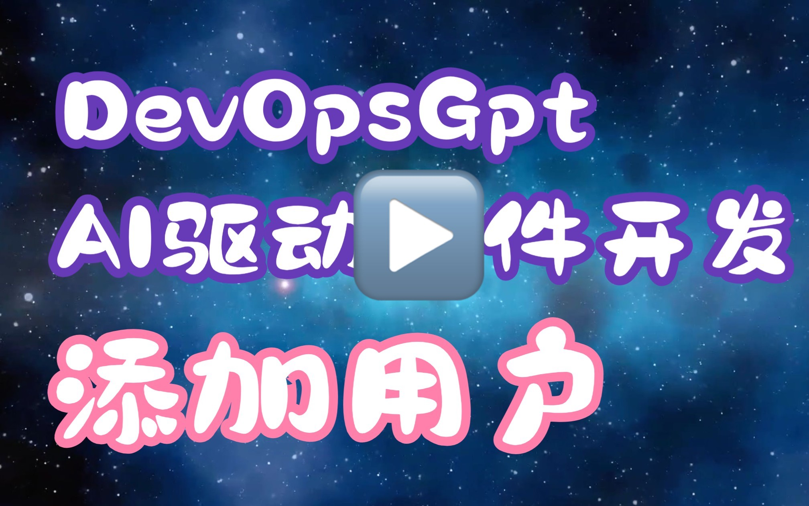
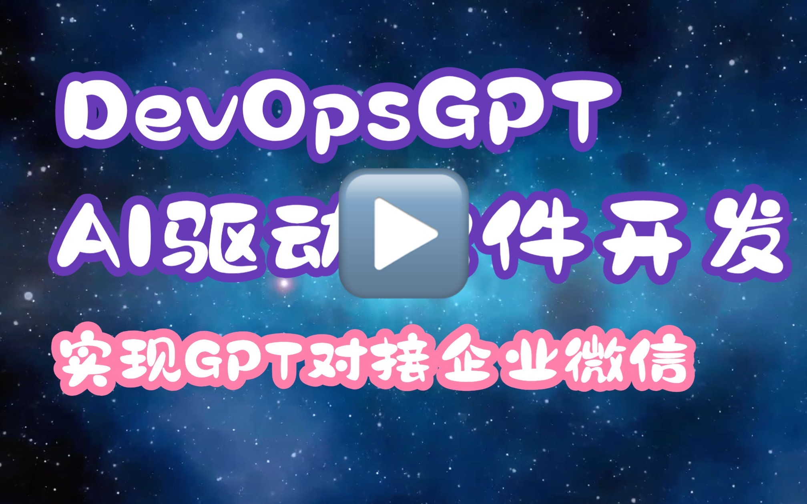
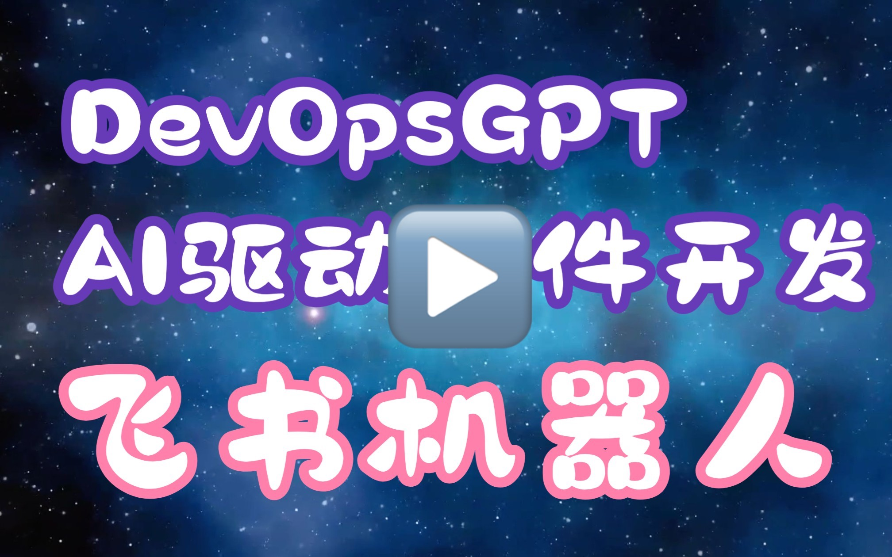
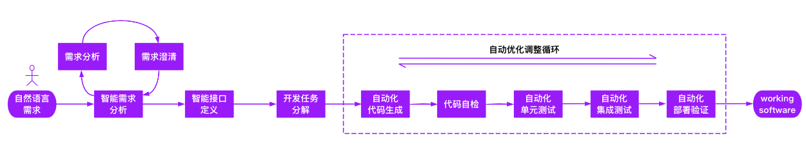

# DevOpsGPT: AI驱动的智能软件开发平台

<p align="center">
<a href="./README_CN.md"></a>
<a href="../README.md"></a>
<a href="./README_JA.md"></a>
<a href="http://www.kuafuai.net"></a>
<a href="CONTACT.md"></a>
<a href="https://discord.gg/GEGYjrVv"></a>

### 💡 获取帮助 - [Q&A](https://github.com/kuafuai/DevOpsGPT/issues) 
### 💡 提交需求 - [Issue](https://github.com/kuafuai/DevOpsGPT/discussions)
### 💡 使用场景交流 - service@kuafuai.net

<hr/>

## 简介
欢迎了解AI驱动的智能软件开发平台（以下简称 DevOpsGPT）。我们将 LLM（Large Language Model）和 DevOps 工具相结合，通过利用Chat-GPT等大型语言模型的能力，将自然语言需求转化为可工作的软件。这一创新功能可以极大地提高开发效率，缩短开发周期，并降低沟通成本，从而带来更高质量的软件交付。

</a>

## 功能与优势
通过使用 DevOpsGPT，您将获得以下优势:

- 提高开发效率：无需编写繁琐的需求文档和解释，开发人员可以直接与 DevOpsGPT 进行交互，快速将需求转化为可工作的软件。
- 缩短开发周期：自动化的软件开发流程大大缩短了交付周期，加速软件的上线和迭代。
- 减少沟通成本：通过准确理解用户需求，DevOpsGPT 降低了沟通错误和误解的风险，提高开发团队和业务团队之间的合作效率。
- 高质量交付：DevOpsGPT 自动生成代码并进行验证，确保交付的软件质量和可靠性。
- 【商业版】既有项目分析：通过AI，自动分析既有项目信息，精准的在既有项目基础上进行需求任务的分解和开发。
- 【商业版】专业模型选择：支持在专业领域比 GPT 更强的语言模型服务来更好的完成需求开发任务，并支持私有化部署。
- 【商业版】支持更多 DevOps 平台：可对接更多 DevOps 平台，实现开发部署全流程的打通。


## 功能演示（点击播放）
1. 全流程演示：开发一个网页游戏并部署到阿里云
<a href="https://www.bilibili.com/video/BV1cV4y1e7zg" target="_blank">点击查看视频</a>

2. Java SpringBoot，开发一个新接口，实现新增用户信息
   
   <a href="https://www.bilibili.com/video/BV1vu411V7jT" target="_blank"></a>

3. Python，用GPT对接企业微信，实现自动总结会议纪要，并发送到企微群中

    <a href="https://www.bilibili.com/video/BV1Vz4y1t7F8" target="_blank"></a>

4. Java SpringBoot，飞书天气预报机器人，实现获取天气信息，并发送到飞书群中

    <a href="https://www.bilibili.com/video/BV1DV4y147no" target="_blank"></a>


## 工作流程
通过以上介绍和 Demo 的演示，你一定好奇，DevOpsGPT 是如何在既有项目中实现自动化需求开发全过程的？下面简单介绍一下整个流程：



- 澄清需求文档：使用 DevOpsGPT 与开发人员进行交互，澄清和确认需求文档中的细节。
- 生成接口文档：DevOpsGPT 可以根据需求生成相应的接口文档，方便开发人员进行接口设计和实现。
- 基于既有项目编写伪代码：通过分析已有项目，DevOpsGPT 可以生成相应的伪代码，为开发人员提供参考和起点。
- 代码功能完善以及优化：开发人员在生成的代码基础上进行功能完善和优化。
- 持续集成：使用 DevOps 工具进行持续集成，确保代码的集成和测试过程自动化。
- 软件版本发布：通过 DevOpsGPT 和 DevOps 工具，将软件版本发布到目标环境。

## 在线环境
直接访问 [kuafuai.net](https://www.kuafuai.net)


## 快速开始

1. 源码运行
    1. 选择[已发布的版本](https://github.com/kuafuai/DevOpsGPT/releases)或者克隆最新代码（不稳定），准备好 SQLite 和 Python3.7 或以上版本。
    2. 生成配置文件：复制 `env.yaml.tpl` 并重命名为 `env.yaml`。
    3. 修改配置文件：编辑 `env.yaml`，添加GPT Token等必要信息。
    4. 运行服务：在 Linux 或 Mac 上执行 `sh run.sh`，在 Windows 上双击运行 `run.bat`。
    5. 访问服务：通过浏览器访问服务（启动日志中提供的访问地址，默认为 http://127.0.0.1:8080）。
    6. 完成需求开发：按照页面引导完成需求开发，在 `./workspace` 目录下查看生成的代码。

2. Docker运行
    1. 创建一个目录：`mkdir -p workspace`
    2. 从代码仓库中复制 [env.yaml.tpl](https://github.com/kuafuai/DevOpsGPT/blob/master/env.yaml.tpl) 到当前目录，并重命名为 `env.yaml`
    3. 修改配置文件：编辑 `env.yaml`，添加GPT Token等必要信息。
    4. ```
        docker run -it \
        -v$PWD/workspace:/app/workspace \
        -v$PWD/env.yaml:/app/env.yaml \
        -p8080:8080 -p8081:8081 kuafuai/devopsgpt:latest
        ```
    5. 访问服务：通过浏览器访问服务（启动日志中提供的访问地址，默认为 http://127.0.0.1:8080）
    6. 完成需求开发：按照页面引导完成需求开发，在 `./workspace` 目录下查看生成的代码

**详细文档和配置参数请参考 [文档链接](./DOCUMENT_CN.md)。**


## 约束
尽管我们尝试利用大型语言模型提升软件开发效率并降低门槛，但当前仍存在一些限制：

- 需求文档和接口文档的生成效果可能还不够精准，在复杂的场景下无法一次性满足开发者的意图。
- 在当前开源版本中，对既有项目代码的理解无法自动化实现。但现实世界中的软件开发，往往是基于既有项目代码进行修改和扩展。目前，对于基于既有项目代码进行开发的场景，我们已经找到了一些解决方案，并在验证阶段取得了良好的效果。这部分工作成果，我们将在企业级版本中提供并在适当的时候进行开源，敬请期待！

## 产品规划

- 精准的需求拆分和基于既有项目的开发任务分解功能。
- 全新的产品体验，快速导入开发需求，并进行自动化软件发布。
- 引入更多软件工程工具和专业工具，在AI编排下快速完成各类软件开发工作。

我们诚邀您[参与 DevOpsGPT 项目](./CONTRIBUTING.md)，共同推动软件开发的自动化和创新，构建更智能、高效的软件系统！

## 免责声明

本项目 DevOpsGPT 是一个实验性应用程序，“按原样”提供，不提供任何明示或暗示的保证。通过使用本软件，您同意承担与使用本软件相关的所有风险，包括但不限于数据丢失、系统故障或任何其他可能出现的问题。

对于因使用本软件而可能发生的任何损失、损害或其他后果，本项目的开发者和贡献者不承担任何责任或义务。您对基于 DevOpsGPT 提供的信息所采取的任何决定和行动全权负责。

请注意，由于使用了令牌，使用 GPT 语言模型的成本可能会很高。通过使用此项目，您承认您有责任监控和管理您自己的令牌使用情况和相关成本。强烈建议定期检查 OpenAI API 的使用情况，并设置必要的限制或警报，以防止意外收费。

作为一项自主实验，DevOpsGPT 可能会生成与现实世界的业务实践或法律需求不一致的内容或采取的行动。您有责任确保基于本软件输出的任何行动或决定符合所有适用的法律、法规和道德标准。本软件的开发者和贡献者不对因使用本软件而产生的任何后果负责。

通过使用 DevOpsGPT，您同意对因使用本软件或违反本条款而产生的任何和所有索赔、损害、损失、责任、成本和费用(包括合理的律师费)对开发人员、贡献者和任何关联方进行赔偿、辩护和保护，使其免受损害。

## 参考项目
- https://github.com/Significant-Gravitas/Auto-GPT
- https://github.com/AntonOsika/gpt-engineer
- https://github.com/hwchase17/langchain
