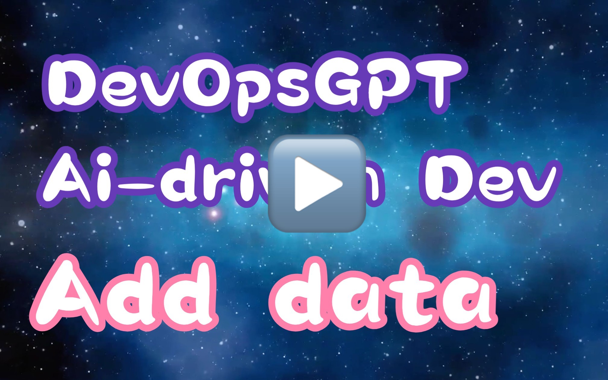

# DevOpsGPT: AI 主導のソフトウェア開発自動化ソリューション

<p align="center">
<a href="./README_CN.md"></a>
<a href="../README.md"></a>
<a href="./README_JA.md"></a>
<a href="http://www.kuafuai.net"></a>
<a href="CONTACT.md"></a>
<a href="https://discord.gg/GEGYjrVv"></a>

### 💡 ヘルプ - [Q&A](https://github.com/kuafuai/DevOpsGPT/issues)
### 💡 リクエストの送信 - [Issue](https://github.com/kuafuai/DevOpsGPT/discussions)
### 💡 技術的交流 - service@kuafuai.net

<hr/>

## はじめに
AI Driven Software Development Automation Solution（略称: DevOpsGPT）へようこそ。LLM（大規模言語モデル）と DevOps ツールを組み合わせることで、自然言語による要求を実用的なソフトウェアに変換します。この革新的な機能により、開発効率の大幅な向上、開発サイクルの短縮、コミュニケーションコストの削減を実現し、より高品質なソフトウェアを提供します。

</a>

## 特長とメリット

- 開発効率の向上 面倒な要件文書の作成や説明は不要です。ユーザーは DevOpsGPT と直接やり取りすることで、要件を迅速に機能的なソフトウェアに変換できます。
- 開発サイクルの短縮: 自動化されたソフトウェア開発プロセスにより、納期が大幅に短縮され、ソフトウェアのデプロイとイテレーションが加速されます。
- コミュニケーションコストの削減: ユーザー要件を正確に理解することで、DevOpsGPT はコミュニケーションエラーや誤解のリスクを最小限に抑え、開発チームとビジネスチーム間のコラボレーション効率を高めます。
- 高品質の成果物: DevOpsGPT がコードを生成し、検証を行うことで、納品されるソフトウェアの品質と信頼性を確保します。
- [エンタープライズ版] 既存プロジェクト分析 AI により、既存プロジェクト情報を自動分析し、既存プロジェクトをベースに必要なタスクを正確に分解・開発します。
- [エンタープライズ版] 専門的なモデル選択： 専門分野のGPTより強力な言語モデルサービスをサポートし、より良い要件開発タスクを完成させ、プライベートな展開をサポートします。
- [エンタープライズ版] より多くの DevOps プラットフォームをサポート: より多くの DevOps プラットフォームと接続し、全プロセスの開発と展開を実現できます。

## デモ（クリックしてビデオを再生）

<a href="https://www.youtube.com/watch?v=IWUPbGrJQOU" target="_blank"></a>


## ワークフロー
上記の紹介とデモを通じて、DevOpsGPT が既存プロジェクトにおける要件開発の自動化プロセス全体をどのように実現しているのかに興味を持たれたことでしょう。以下は、プロセス全体の概要です:


- 要求文書の明確化 DevOpsGPT と対話し、要件ドキュメントの詳細を明確にし、確認する。
- インターフェース・ドキュメントの生成: DevOpsGPT は要件に基づいてインターフェース・ドキュメントを生成し、開発者のインターフェース設計と実装を容易にします。
- 既存のプロジェクトに基づいて擬似コードを記述する: 既存のプロジェクトを分析して対応する擬似コードを生成し、開発者にリファレンスと出発点を提供します。
- コード機能の洗練と最適化: 開発者は、生成されたコードに基づいて機能を改善し、最適化します。
- 継続的インテグレーション: 継続的インテグレーション用の DevOps ツールを活用し、コードの統合とテストを自動化する。
- ソフトウェアバージョンのリリース: DevOpsGPT と DevOps ツールを使用して、ソフトウェアバージョンをターゲット環境にデプロイする。

## クイックスタート

1. ソースコードの実行
    1. [リリースバージョン](https://github.com/kuafuai/DevOpsGPT/releases)を選択するか、最新のコードをクローン（不安定）し、SQLiteとPython 3.7以上を準備します。
    2. 設定ファイルの生成：`env.yaml.tpl`をコピーして`env.yaml`として名前を変更します。
    3. 設定ファイルの変更：`env.yaml`を編集し、必要なGPTトークンなどを追加します。
    4. サービスの実行：LinuxまたはMacで`sh run.sh`を実行し、Windowsで`run.bat`をダブルクリックして実行します。
    5. サービスへのアクセス：ブラウザを使用してサービスにアクセスします（起動ログに表示されるアクセスアドレス、デフォルトは http://127.0.0.1:8080）。
    6. 要件の開発の完了：ページの案内に従って要件の開発を完了し、`./workspace`ディレクトリで生成されたコードを確認します。

2. Dockerの実行
    1. ディレクトリを作成します：`mkdir -p workspace`
    2. コードリポジトリから [env.yaml.tpl](https://github.com/kuafuai/DevOpsGPT/blob/master/env.yaml.tpl) を現在のディレクトリにコピーし、`env.yaml` として名前を変更します。
    3. 設定ファイルの変更：`env.yaml`を編集し、必要なGPTトークンなどを追加します。
    4. ```
        docker run -it \
        -v$PWD/workspace:/app/workspace \
        -v$PWD/env.yaml:/app/env.yaml \
        -p8080:8080 -p8081:8081 kuafuai/devopsgpt:latest
        ```
    5. サービスへのアクセス：ブラウザを使用してサービスにアクセスします（起動ログに表示されるアクセスアドレス、デフォルトは http://127.0.0.1:8080）。
    6. 要件の開発の完了：ページの案内に従って要件の開発を完了し、`./workspace`ディレクトリで生成されたコードを確認します。


## 制限事項
私たちは、大規模言語モデルの助けを借りて、エンタープライズレベルのソフトウェア開発効率を高め、障壁を低減するよう努めていますが、現在のバージョンにはまだいくつかの制限があります:

- 複雑なシナリオでは、要求とインターフェースドキュメントの生成は十分に正確でなく、開発者の意図を満たさない可能性があります。
- 現在のバージョンでは、既存のプロジェクト・コードの理解を自動化することはできません。私たちは、検証中に有望な結果を示した新しいソリューションを模索しており、将来のバージョンで導入する予定です。

## 製品ロードマップ

- 既存プロジェクトに基づく正確な要件分解と開発タスクのブレークダウン。
- 開発要求の迅速なインポート、ソフトウェア開発と配備の並行自動化のための新しい製品体験。
- より多くのソフトウェアエンジニアリングツールと専門的なツールを導入し、AI プランニングとエクゼキューションの下で様々なソフトウェア開発タスクを迅速に完了する。

DevOpsGPT プロジェクトに参加し、ソフトウェア開発の自動化と革新に[コントリビュート](./CONTRIBUTING.md)することで、よりスマートで効率的なソフトウェアシステムを構築してください！

## 免責事項

このプロジェクト、DevOpsGPT は実験的なアプリケーションであり、明示または黙示を問わず、いかなる保証もなく「現状のまま」提供されます。このソフトウェアを使用することで、データ損失、システム障害、または発生する可能性のあるその他の問題を含め（ただし必ずしもこれらに限定されない）、その使用に関連するすべてのリスクを負うことに同意するものとします。

このプロジェクトの開発者および貢献者は、このソフトウェアを使用した結果生じる可能性のある損失、損害、その他の結果について、いかなる責任も負いません。DevOpsGPT によって提供された情報に基づいて行われた決定や行動については、利用者のみが責任を負うものとします。

GPT 言語モデルの使用は、そのトークン使用により高価になる可能性があることに注意してください。このプロジェクトを利用することで、利用者は自身のトークン使用量と関連コストを監視・管理する責任があることを認めることになります。定期的に OpenAI API の使用量をチェックし、予期せぬ課金を防ぐために必要な制限やアラートを設定することを強くお勧めします。

自律的な実験として、DevOpsGPT は、現実のビジネス慣行や法的要件に沿わないコンテンツを生成したり、行動を起こしたりする可能性があります。本ソフトウェアの出力に基づいて行われる行動や決定が、適用されるすべての法律、規制、および倫理基準に準拠していることを確認するのはあなたの責任です。このプロジェクトの開発者および貢献者は、このソフトウェアの使用から生じるいかなる結果に対しても責任を負いません。

DevOpsGPT を使用することにより、あなたは、このソフトウェアの使用またはこれらの条項の違反に起因するあらゆる請求、損害、損失、責任、費用、および経費（合理的な弁護士費用を含む）から、開発者、貢献者、および関連当事者を免責し、防御し、損害を与えないことに同意するものとします。

## 参考プロジェクト
- https://github.com/Significant-Gravitas/Auto-GPT
- https://github.com/AntonOsika/gpt-engineer
- https://github.com/hwchase17/langchain
