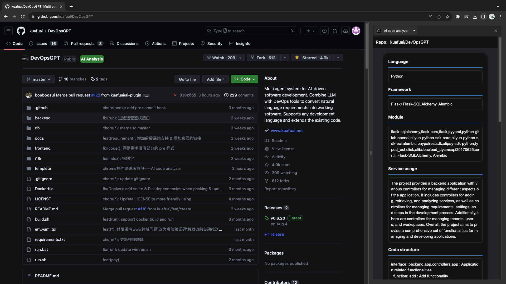
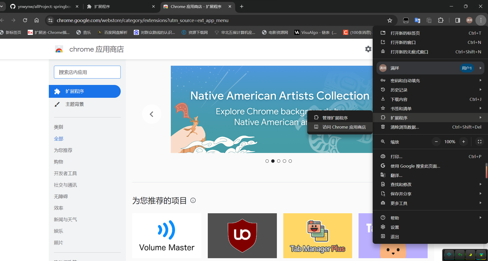
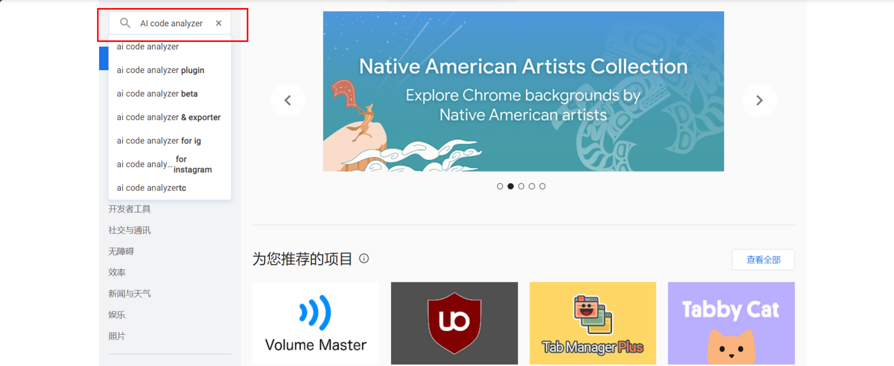
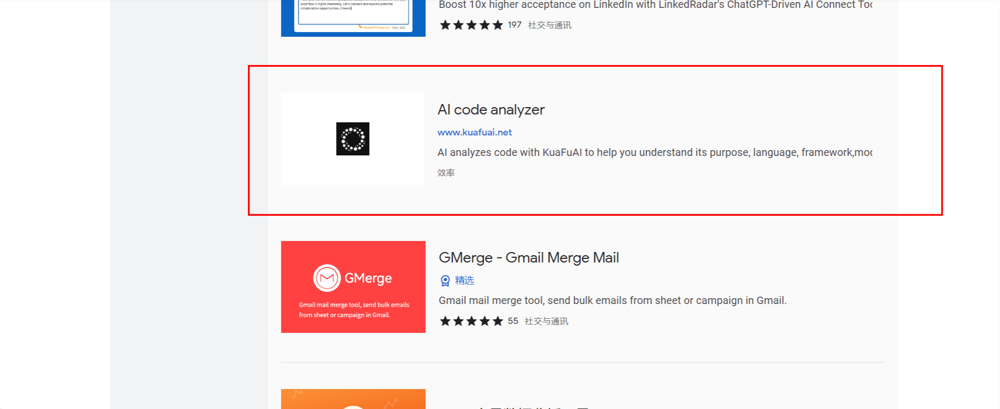
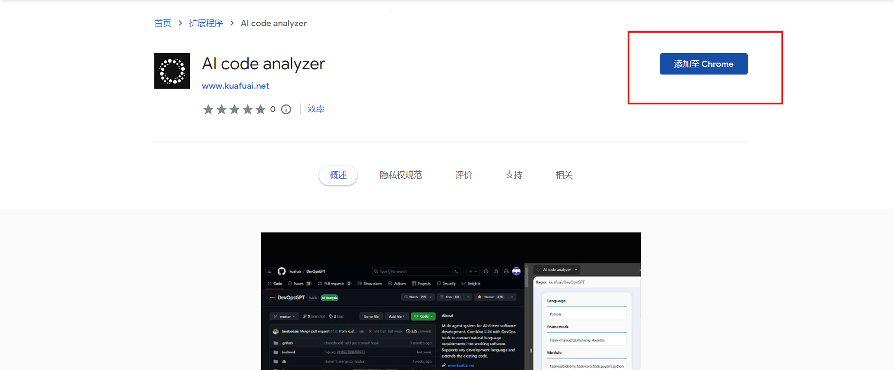
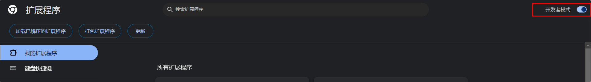
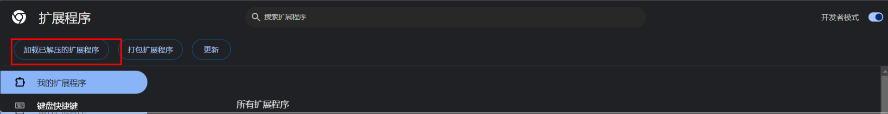

# AI code analyzer

## 用途介绍

**AI code analyzer** 插件旨在通过**一键式操作**，为不同水平的开发者提供专业、全面且直观的代码分析，无论用户处于学习曲线的哪个点，都能有效提升他们的工作效率和代码理解，

以本项目为例，可以看到仓库名称后面的 AI Analysis ，点击后，短短几秒，插件便展开了全面分析，它精准捕获了 DevOpsGPT 项目的语言精髓、框架构建、使用的模块、服务用途，乃至代码结构的全貌。

同时本插件具备以下优势：

- **多语言分析：**从 Python 到 Java ，再到 JavaScript ，支持多种语言一键分析。
- **框架识别：**是 React 还是 Vue？Springboot 还是 Flask ，AI Analysis 带您秒懂项目背后的框架选择。
- **模块用途：**每个库和模块，它都能为您描绘清晰的功能地图。
- **实时反馈：**在浏览 GitHub 时，我们的AI助手提供即时的代码分析，帮助你辨识最佳实践和常见模式，就像有一位私人导师在旁指导。
- **连接概念与实际应用：**通过分析真实世界的项目，你可以看到理论如何转化为实践，加深对编程语言和框架的理解。
- **深度代码分析：**即使是最复杂的项目，我们的插件也能提供深入的代码结构和框架分析，帮助你快速定位到重要的部分。

## 安装方式

### 扩展市场安装

- 点击Chrome浏览器右上角图标，扩展程序，访问Chrome应用商店

- 搜索框中输入“AI code analyzer”，点击搜索

- 点击“更多扩展程序”

- 找到如下列表项，点击进入详情页

- 点击“添加到Chrome”，即可完成安装

### 源码安装

- 点击Chrome浏览器右上角图标，扩展程序，管理扩展程序

- 打开“开发者模式”

- 点击“加载已解压的扩展程序”

- 选择源码根目录，点击确认，即可完成插件的安装

